# KS0389 keyestudio ESP8266 WiFi Module (Black and Eco-friendly)


## 1. Description

This keyestudio ESP8266 WI-FI development board is based on the ESP8266-12FWIFI module developed by Ai-Thinker.

The processor ESP8266 integrates the industry-leading Tensilica L106 ultra-low-power 32-bit micro MCU in a smaller package, with 16-bit Lite mode. The main frequency supports 80MHz and 160 MHz.

It supports RTOS, integrated with Wi-Fi MAC/BB/RF/PA/LNA. Onboard comes with curved antenna.

This development board is a standalone network controller, which can add networking function to those existing devices.

When using, power the board and upload the program via a Micro USB port, and the current supply should be 2A.

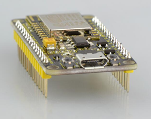

## 2. Technical Details

- Microcontroller: ESP8266-12F WIFI Module
- USB to Serial Chip: CP2102-GMR
- Operating Voltage: DC5V
- Input Current: 2A
- Main frequency supports 80 MHz and 160 MHz
- Analog Input Pins: 1(A0)
- Micro USB cable: 1m
- Dimensions: 49mm * 26mm * 12mm

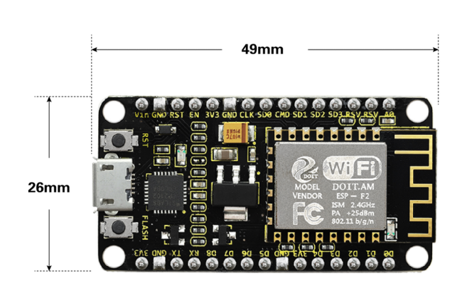

## 3. Element and Interfaces

Here is an explanation of what every element and interface of the board has:

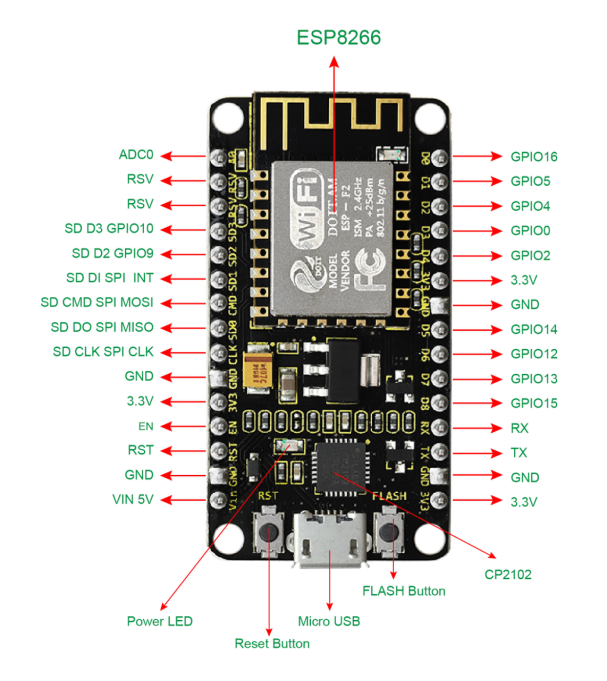

## 4. Specialized Functions of Some Pins

- Serial communication pins: RX and TX
- SPI communication pins: CLK(CLK); SD0(MIS0); CMD(MOSI); SD1(INT).
- SD Card communication pins: D3(SD3); D2(SD2); D1(SD1); CMD(CMD); D0(SD0); CLK(CLK).
- Analog output pin: A0
- GPIO pins: D0(GPIO16); D1(GPIO5); D2(GPIO4); D3(GPIO0); D4(GPIO2); D5(GPIO14); D6(GPIO12); D7(GPIO13); D8(GPIO15); RX(GPIO3); TX(GPIO1); SD3(GPIO10); SD2(GPIO9)

## 5. Detailed Using Method as follows

### 5.1 Install the Arduino IDE

Open the browser and search:  https://www.arduino.cc/en/software, we will take WINDOWS system as an example to show you how to download and install.


You just need to click JUSTDOWNLOAD,then click the downloaded file to install it.And when the ZIP file is downloaded,you can directly unzip and start it.


### 5.2  Install the Driver

**5.2.1 Windows System**

**Checking the driver**

1. Connect the motherboard to the computer.


Open Device Manager，Open the device manager, if the prompt **"Silicon Labs CP210x USB to UART Bridge (COMx)"** appears to prove that the driver has been installed, please skip the **"Driver installation"** part.


**Manual driver installation**

1. Driver download

- Windows System: [Windows System driver](./Windows.7z)

2. Connect the motherboard to the computer, open the device manager, if there is a yellow exclamation mark in front of the driver in the picture, it proves that the driver is not installed, please download the driver and install it manually.


**5.2.2 MAC System**

**1 Checking the driver**

Connect the development board to the computer, according to [Tools] ---> [Port] to select the development board port (Note: If you can not confirm which port is the development board, please connect the motherboard to take pictures to record all the ports, and then unplug the development board to re-take pictures to record all the ports, and then compare to find the disappeared ports, and then unplug the motherboard after the disappeared ports is the port of the board, and then select the port on the line)If you can not recognize the port, please replace the computer USB port or around the phone cable to re-recognize the port, if it still does not work refer to the following steps to install the driver.


**2 Manual driver installation**

1. Driver download

​       Mac System: [Mac System driver](./Mac.7z)

2. double-click to decompress the downloaded driver zip package


3. After that keep **"Next ”** installing until the installation is complete


At this point, the port can be recognized by plugging in the board again.

4. Then go to the Arduino IDE, click on “Tools”, select the board Arduino Uno and the recognized development board port。


5. Click to upload code and show “Done uploading”.


### 5.3 Install the ESP8266 with Arduino

Double-click the icon of Arduino software downloaded well, you will get the interface shown below.

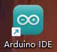

The functions of each button on the Toolbar are listed below:


| Picture                                | Name               | Introduction                                        |
| -------------------------------------- | ------------------ | --------------------------------------------------- |
|  | **Verify/Compile** | Check the code for errors                           |
|  | **Upload**         | Upload the current Sketch to the Arduino            |
|  | **Serial Monitor** | Display the serial data being sent from the Arduino |

Firstly, plug one end of your USB cable into the Keyestudio ESP8266 WI-FI module and the other into a USB socket on your computer.

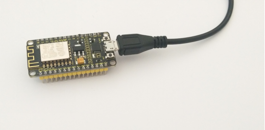

Then open the Arduino IDE, click the “File” to select the “Preferences”.

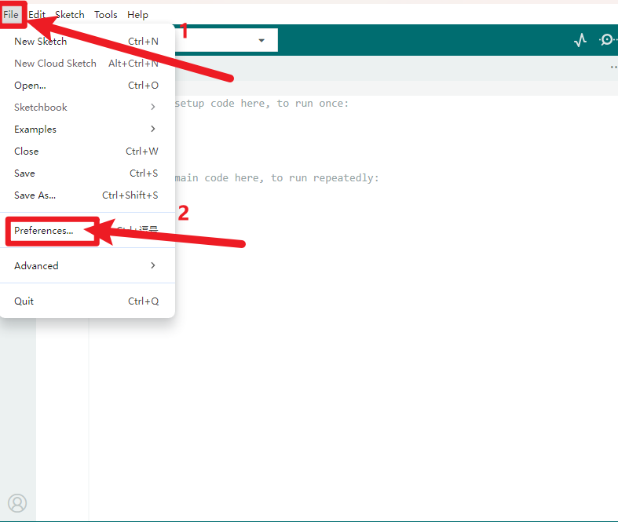

The pop-up interface is shown below. See the “Additional Boards Manager URLs”, copy and paste the link below: http://arduino.esp8266.com/stable/package_esp8266com_index.json. and then click "OK".

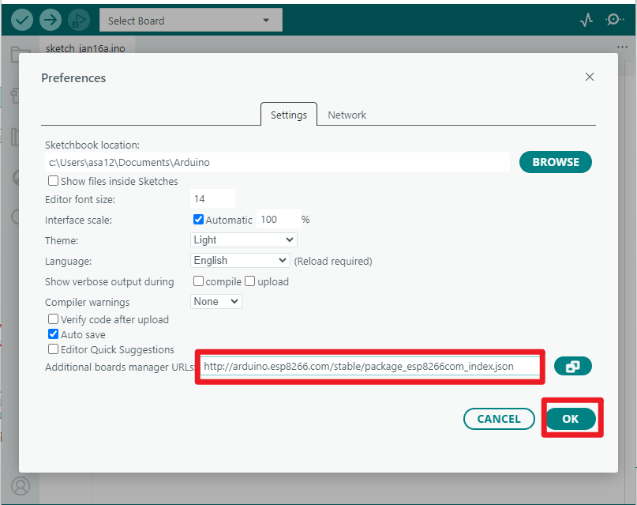

After that, click “Tools”, for “Board”, enter the "Boards Manager", it will automatically download the relevant file. Shown below.


Pop up the following window:

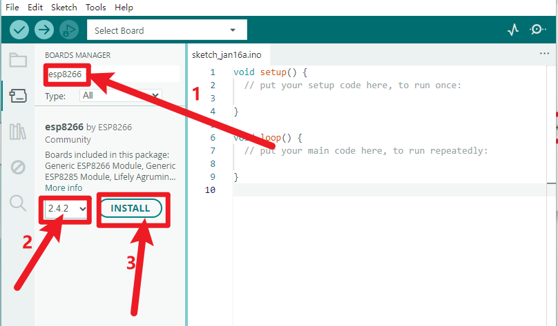

Installation completed, click Close, then click “Tools”, for “Board”, you should see the "**NodeMCU 1.0 (ESP-12E Module)**". Shown below.

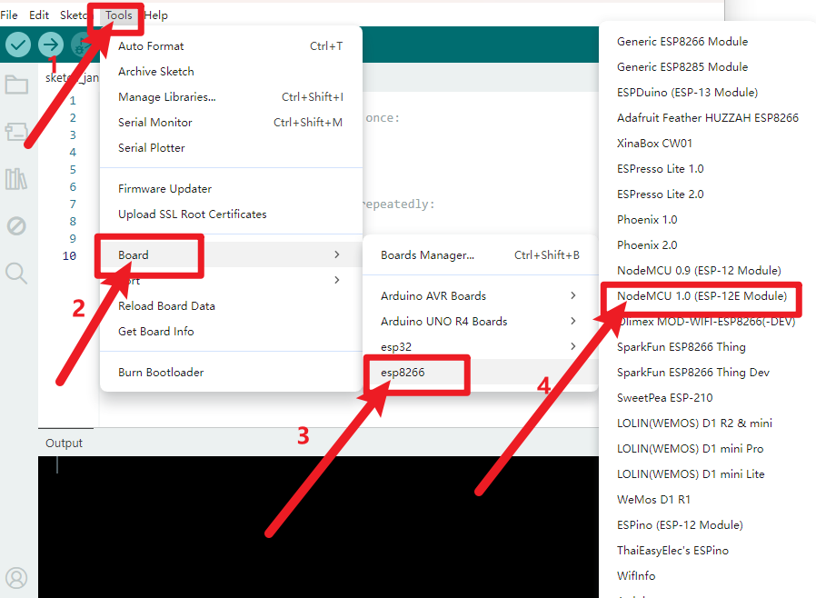

### 5.4 Add the Libraries

Download Resources :  [Resources](./Resources.7z)

Open the Arduino IDE, follow [Sketch] → [Include Library] → [Add .zip Library]. 


### 5.5 Select the Board and Serial Port

Open the Arduino IDE, click the “Tools”, then select the Board .


 Select the Serial Port.

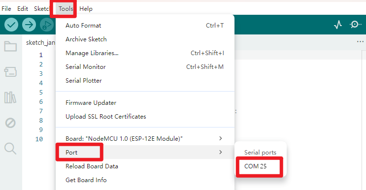

You can check out the Serial Port on your computer’s Device Manager.
Select your proper COM Port.

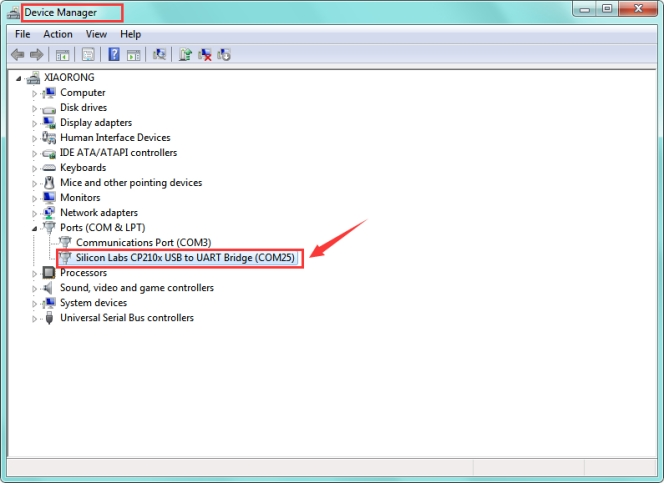

### 5.6 Upload the Code

Note： before uploading the code, you need to import the library files; otherwise, the code upload will fail.

```c
#include "ESP8266WiFi.h"

void setup() 
{
  Serial.begin(115200);
  // Set WiFi to station mode and disconnect from an AP if it was previously connected
  WiFi.mode(WIFI_STA);
  WiFi.disconnect();
  delay(100);
  Serial.println("Setup done");
}

void loop() 
{
  Serial.println("scan start");
  // WiFi.scanNetworks will return the number of networks found
  int n = WiFi.scanNetworks();
  Serial.println("scan done");
  if (n == 0)
    Serial.println("no networks found");
  else
  {
    Serial.print(n);
    Serial.println(" networks found");
    for (int i = 0; i < n; ++i)
    {
      // Print SSID and RSSI for each network found
      Serial.print(i + 1);
      Serial.print(": ");
      Serial.print(WiFi.SSID(i));
      Serial.print(" (");
      Serial.print(WiFi.RSSI(i));
      Serial.print(")");
      Serial.println((WiFi.encryptionType(i) == ENC_TYPE_NONE)?" ":"*");
      delay(10);
    }
  }
  Serial.println("");
  // Wait a bit before scanning again
  delay(5000);
}
```

After copy and paste the code on IDE, click the compile button, if compiling successfully, the message "Done compiling." will appear in the status bar.

### 5.7 Result

Done uploading the code, open the serial monitor and set the baud rate to 115200, you should see all the WIFI information.

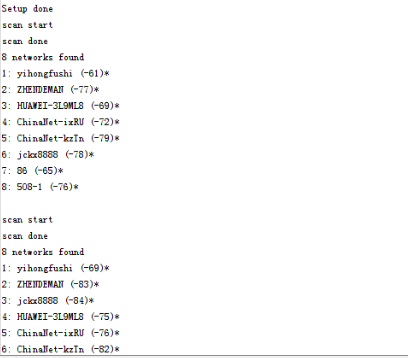

## 6. Package Includes

- Keyestudio ESP8266 WI-FI module* 1
- USB cable * 1

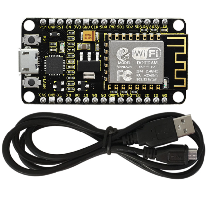